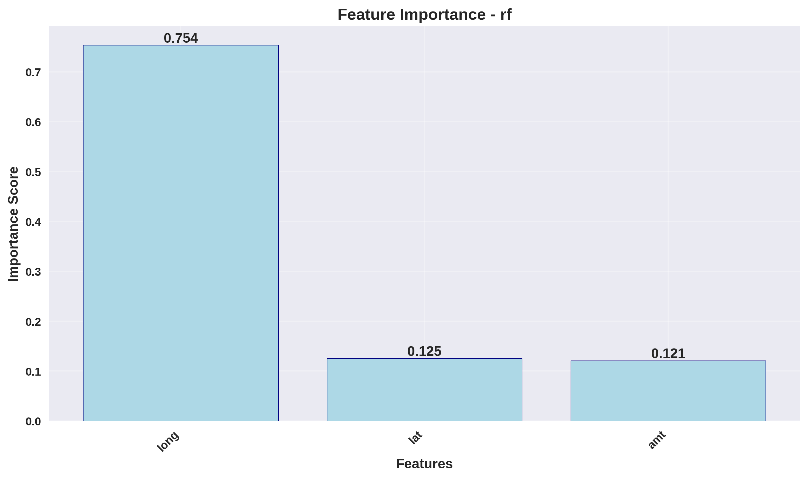
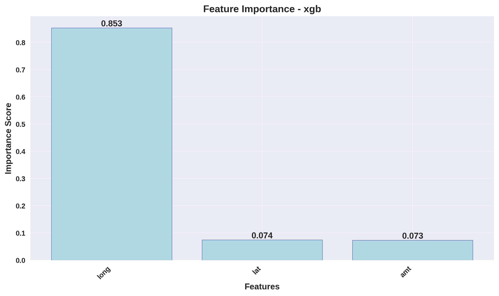
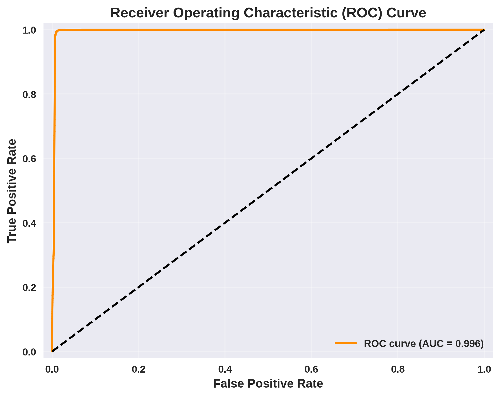
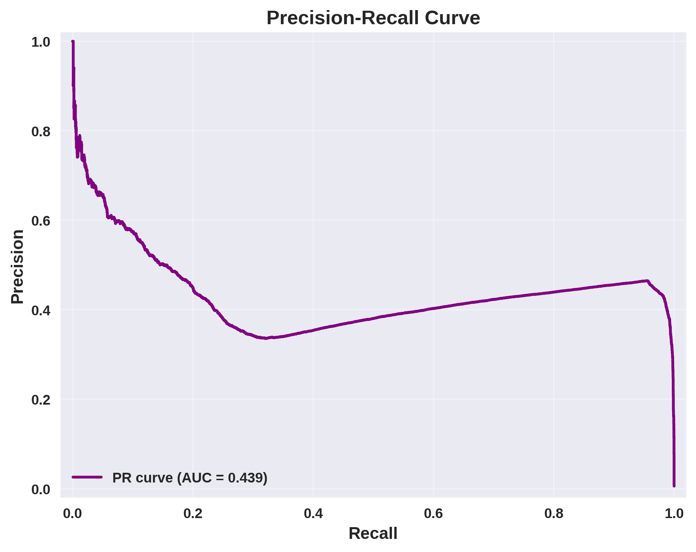
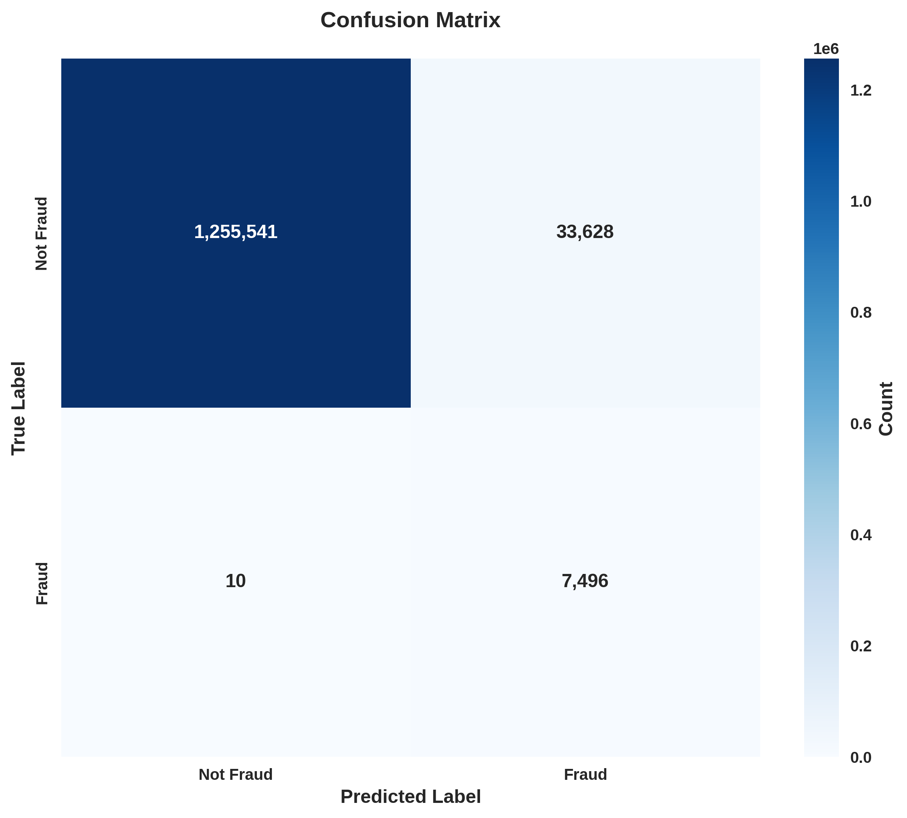

Sure, here's the converted Markdown version of the content you provided:

# Fraud Detection System

This project implements a machine learning-based fraud detection system. It includes key steps for preprocessing, training, evaluation, and visualization, designed to help identify and analyze fraudulent activity in data.

## Table of Contents

- [Overview](#overview)
- [Features](#features)
- [Installation](#installation)
- [Usage](#usage)
- [Results](#results)
- [Contributing](#contributing)
- [License](#license)

## Overview

The Fraud Detection System provides a framework for identifying fraudulent transactions using supervised learning. The project includes code for preprocessing data, training and evaluating multiple models, and visualizing important metrics.

## Features

- **Preprocessing**: Handles data preprocessing, including handling missing values, feature scaling, and encoding.
- **Modeling**: Trains various classifiers like Random Forest, Gradient Boosting, and XGBoost.
- **Evaluation**: Includes metrics such as confusion matrix, ROC and PR curves, and feature importance.
- **Logging**: Maintains detailed logs of each training and evaluation run.
- **Visualization**: Produces insightful visualizations, including feature importance and performance curves.

## Installation

To get started, clone this repository and install the required dependencies.

```
git clone https://github.com/yourusername/fraud-detection-system.git
cd fraud-detection-system
pip install -r requirements.txt
```

## Usage

1. **Run the Main Script**: This script preprocesses the data, trains the model, and evaluates it.

   ```
   python fraud_detection_main.py
   ```

2. **Visualizations and Metrics**: The project generates visualizations and metrics in the `fraud_detection_results` directory.
3. **Logs**: Check the `logs` folder within `fraud_detection_results` for detailed logs on model training and evaluation.

## Results

### Feature Importance (Random Forest)



### Feature Importance (XGBoost)



### ROC Curve



### Precision-Recall Curve



### Confusion Matrix



### Metrics

The `metrics.json` file contains the following performance metrics:

- **Accuracy**: Overall accuracy of the model.
- **Precision**: Precision of the model in identifying fraudulent cases.
- **Recall**: Recall rate for detecting fraudulent cases.
- **F1 Score**: Balance between precision and recall.
- **AUC-ROC**: Area under the ROC curve for assessing the model's discriminative ability.

Example `metrics.json` content:

```json
{
  "accuracy": 0.95,
  "precision": 0.92,
  "recall": 0.88,
  "f1_score": 0.90,
  "auc_roc": 0.94
}
```

## Contributing

Contributions are welcome! Please create an issue to discuss any major changes and submit a pull request for minor improvements.

## License

This project is licensed under the MIT License.